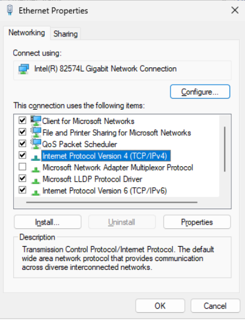
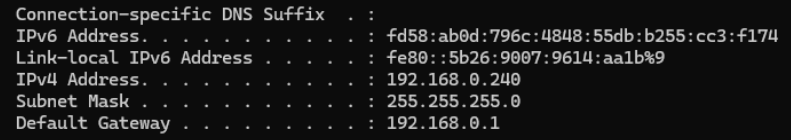
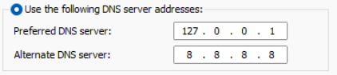

  

## Local Server: AD Configuration
Since I want to create a work environment, I'm going to have this particular computer be set as the Domain Controller, as well as have it act as a dns server

This way I can authenticate users, and allow users to connect to domains

First, some network configurations have to be done before we can establish it as a domain controller
---
## Network Setup
Most computers are set to DHCP and that's fine if we weren't acting as a domain controller. Given that we are, this creates a problem for us as I don't want the Domain Controller's IP to be dynamic leading to network breaks

We have to change it from dynamic to static ip

Steps:
1. Control Panel
2. Network and Internet
3. Click on the connection type
    - Ethernet
4. Go into properties of the IPv4

5. Set the new configuration

Because we don't know what IP this VM is using we have to figure that out using cmd + ipconfig

This VM's ip is set to 192.168.0.240
The Gateway is set to 192.168.0.1

With this, I can assign the static IP in the network config

For the DNS server address:
- Primary: I set this to 127.0.0.1, this will tell the server to reference itself for any dns queries
- Alternate: I set this to Google's DNS 8.8.8.8 so I can query general things on the internet

---
With this now configured, I can now start the Domain Controller set up

