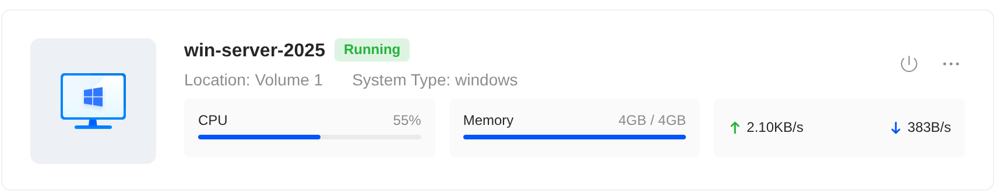
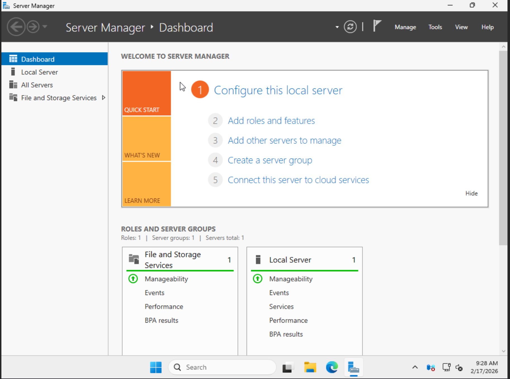

## Setting up Windows Server 2025 with Desktop Environment on VM

Using UGOS Pro Virtual Machine, I initiated a VM with Windows Server 2025 w/ Desktop with 4 GB of memory, and 60 GB of storage.

I chose to go with the Desktop Environment as I wanted to be familiar with how the GUI looks like as most work environments will be using this.

From here I'll set up the Local Servers, the Roles, and connect a clusters of servers to it to simulate what a true work environment would look like and deal with

Along side those initial set ups, I will also create mock issues to see how I would go about in resolving them.

